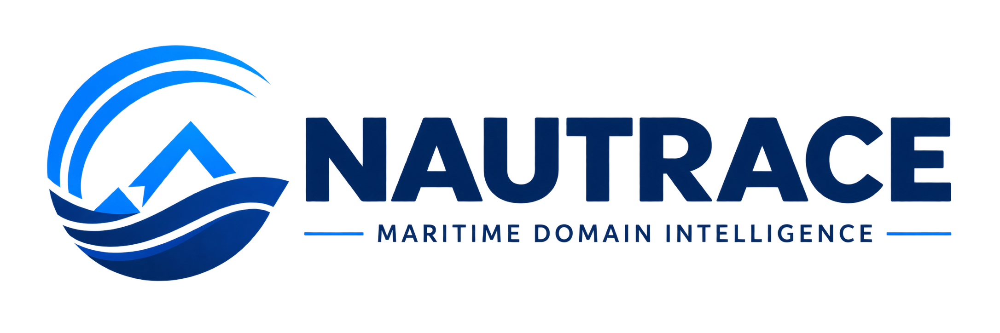

# Nautrace

<p align="center">
  
</p>

<p align="center">
  <strong>Satellite-powered oil-spill detection, drift reconstruction, and evidence-led vessel attribution.</strong>
</p>

Nautrace is a maritime-domain intelligence platform for investigating possible marine oil-pollution events. It connects satellite imagery, ocean and weather forcing, and vessel-track data to turn a detected slick into a transparent, ranked set of investigative hypotheses.

> **Decision-support, not an accusation engine.** Nautrace identifies vessels that warrant further investigation under stated assumptions. Its results must be corroborated with operational and legal evidence before enforcement action.

## The problem

A dark region in synthetic-aperture radar (SAR) imagery is not necessarily oil, and the nearest vessel is not necessarily responsible. Wind, currents, tides, waves, and data gaps can separate a spill from its observed location and time. Nautrace addresses the full forensic workflow:

```text
Satellite scene → slick segmentation → look-alike rejection → ensemble hindcast
→ probable origin envelope → AIS reconstruction → explainable vessel ranking
→ provenance-rich investigation report
```

## Core capabilities

- **Oil-slick detection** — identify potential slicks in Sentinel-1 SAR imagery.
- **Look-alike screening** — distinguish likely oil from low-wind zones, natural films, and other dark signatures.
- **Hindcasting and drift uncertainty** — reverse-track the slick using an ensemble of ocean, tide, wind, and Stokes-drift inputs.
- **Vessel attribution support** — reconstruct AIS trajectories and rank candidate vessels by space-time and trajectory compatibility.
- **Unknown-source hypothesis** — account for incomplete, absent, or unreliable AIS coverage rather than forcing an attribution.
- **Explainable evidence reporting** — preserve source identifiers, timestamps, configurations, confidence bounds, and analyst decisions.

## Reference architecture

| Stage | Suggested components | Output |
| --- | --- | --- |
| Observe | Sentinel-1 GRD; optional Sentinel-2, Landsat 8/9 | Georeferenced scene and acquisition metadata |
| Detect | U-Net baseline; SegFormer / DeepLabv3+ candidates | Slick mask, extent, detection confidence |
| Validate | Context features and oil-vs-look-alike classifier | Screened event hypothesis |
| Reconstruct | OpenDrift/OpenOil with Copernicus Marine currents, ECMWF/ERA5 winds | Probable source envelope and uncertainty |
| Correlate | Licensed or historical AIS feeds | Candidate tracks and AIS-continuity assessment |
| Explain | Calibrated scoring, provenance log, map and case report | Ranked investigative leads |

## Evaluation principles

Operational quality goes beyond segmentation IoU. Nautrace should track:

- precision, recall, IoU, and confidence calibration;
- false alarms per scene and per 1,000 km²;
- oil-versus-look-alike confusion;
- origin-envelope coverage and hindcast error;
- attribution-ranking quality, including the **unknown / non-AIS** alternative;
- end-to-end alert latency and report reproducibility.

## Evidence and safety

Every investigation should retain a reproducible provenance trail:

```text
raw product ID + source URI + acquisition time + SHA-256
→ preprocessing configuration + model/version hash
→ forcing-data version + simulation parameters
→ AIS snapshot hash + score calculation + analyst actions
```

The recommended report language is: “the highest-ranked investigative candidate under the stated satellite, AIS, and hindcast assumptions.” It should never state that a vessel caused a spill solely from model output.

## Project material

- [Deep research report](docs/SIH-26143-deep-research-report.pdf) — problem framing, stakeholder needs, recommended data stack, validation approach, and delivery roadmap for SIH Problem Statement 26143.
- [Nautrace brand asset](assets/nautrace-logo.png)

## Suggested MVP

Deliver one complete, defensible workflow before expanding scope:

1. Process one Sentinel-1 scene into a reviewed slick mask.
2. Run a hindcast ensemble to produce an origin envelope.
3. Reconstruct vessels within the resulting space-time window.
4. Publish a ranked, uncertainty-aware candidate list and map.
5. Export a provenance-rich PDF investigation report.

## Status

This repository currently contains the Nautrace brand asset and the foundational research report. Implementation modules, data connectors, and deployment documentation can be added as the MVP is built.

## License

No license has been selected yet. Add one before distributing code or assets externally.
